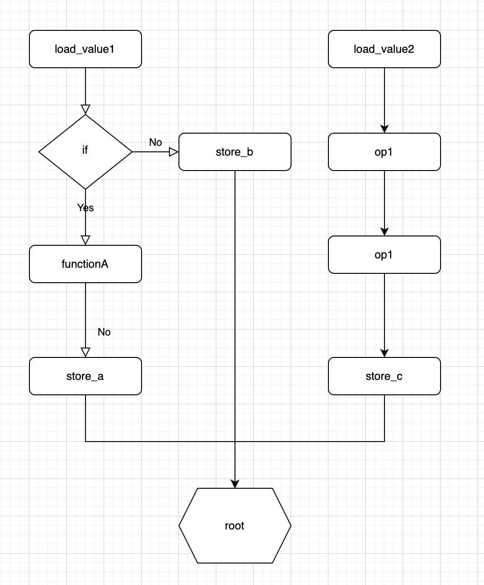

# jitfusion
A execution engine completely based on llvm jit.


# Build
Environment

  * llvm 19.1.7
  * googletest

First, you need to have <span style="color:red">LLVM 19.1.7</span>; other versions will not work. However, if you can only use other versions, you can modify the exec_engine.cc file to adapt it, and it shouldn't require too many changes.

You can use the following command to check your version.
```bash
llvm-config --version
```

## CMake Build
```bash
mkdir CmakeBuild
cd CmakeBuild
cmake .. && make
```

## Bazel Build
If you are using version <span style="color:red">Bazel 8</span> or above, you will need to use the --enable_workspace=true option.

You can get the library use the following command.
```bash
bazel build //:jitfusion
```
You can get the unit test binary use the following command.
```bash
bazel build //:jitfusion_test
```

You can get the athena use the following command.
```bash
bazel build //:athena
```

You can get the athena unit test binary use the following command.
```bash
bazel build //:athena_test
```

# How to use
I considered how many types of nodes are needed to represent a function in the execution engine, and I ultimately abstracted it into 10 types of nodes:

    EntryArgumentNode: A node used to obtain the entry argument variables of a function.

    ExecContextNode: A node used to obtain the context variables of the execution engine.

    ConstValueNode and ConstListValueNode: Constant nodes.

    UnaryOPNode: Unary operation node.

    BinaryOPNode: Binary operation node.

    FunctionNode: Function node.

    IfNode: If condition node.

    SwitchNode: Switch condition node.

    NoOPNode: No operation node.

    OutputNode： Used for optimizing complex scenarios. Data is not returned via a return value but is instead written using a custom store function.


In jitfusion, there are the following data types: u8, u16, u32, u64, i8, i16, i32, i64, float, double, string, u8list, u16list, u32list, u64list, i8list, i16list, i32list, i64list, floatlist, doublelist, stringlist. The type u8 corresponds to uint8_t in C, and so on. The C structures corresponding to all types can be found in the include/type.h file.


For example, generally speaking, the process of an execution flow graph might look like this.


<div align=center></div>
</br>

Typically, the initial node is a data loading node. After a series of operations in the middle to obtain the desired value, the process is completed with a data storing node at the end.

The data reading and writing nodes can both be implemented using EntryArgumentNode and FunctionNode. You can refer to test/entry_argument_node_test.cc for more details. for example:

```c++
int32_t LoadValue(void* data, uint32_t i) { return reinterpret_cast<int32_t*>(data)[i]; }

int main() {
  std::unique_ptr<FunctionRegistry> func_registry;
  FunctionRegistryFactory::CreateFunctionRegistry(&func_registry);
  FunctionSignature sign("load", {ValueType::kPtr, ValueType::kI32}, ValueType::kI32);
  FunctionStructure func_struct = {FunctionType::kCFunc, reinterpret_cast<void*>(LoadValue), nullptr};
  func_registry->RegisterFunc(sign, func_struct);

  auto args_node = std::unique_ptr<ExecNode>(new EntryArgumentNode);
  auto index_node = std::unique_ptr<ExecNode>(new ConstantValueNode(1));
  std::vector<std::unique_ptr<ExecNode>> load_func_args;
  load_func_args.emplace_back(std::move(args_node));
  load_func_args.emplace_back(std::move(index_node));
  auto load_func_node = std::unique_ptr<ExecNode>(new FunctionNode("load", std::move(load_func_args)));

  ExecEngine exec_engine;
  auto st = exec_engine.Compile(load_func_node, func_registry);
  std::cout << st.ToString() << std::endl;
  RetType result;
  std::vector<int32_t> data_list = {100, 200, 300, 400};
  exec_engine.Execute(data_list.data(), &result);
}
```

The EntryArgumentNode will consistently return a u64 value, which is the input parameter for the execution engine's Execute function. By passing this value to a custom function, you can perform operations on this parameter.If you want to achieve maximum performance, you can implement the codegen function. You can refer to the implementations in the src/function directory for guidance.

The intermediate processes can all be converted into corresponding op nodes, function nodes, condition nodes, etc. Additionally, there are usually multiple execution flows within a single task, and these flows may use the same variables. To achieve maximum optimization, you can have all the store nodes ultimately point to a NoOP node, allowing LLVM to perform the optimization for you.

# Optimize
It is more recommended to use this interface.
```c++
  // Applicable to more complex scenarios, users need to use an output node and a custom store function to write data,
  // and it will not return data from the root node. and root node must be the NoOpNode.
  Status Execute(void* entry_arguments, void* result);
```
This function does not return data through the root node; instead, the user provides a pointer for writing, which can be obtained through the OutputNode.This function require that the root node must be the NoOpNode.

It is recommended to divide custom functions into two categories: read-only functions and store functions. Read-only functions can either be data loading functions or computation functions that generate an intermediate variable. It is not recommended for computation functions to directly modify parameter variables; instead, they should return the computation result by generating a new variable. In this case, you can set a read-only attribute for your function, as shown in the code below.

```c++
void ReadOnlyFunctionSetter(llvm::ExecutionEngine* /*engine*/, llvm::Module* /*m*/, llvm::Function* f) {
  f->setDoesNotThrow();
  f->setMemoryEffects(llvm::MemoryEffects::readOnly());
}

FunctionSignature sign("load", {ValueType::kPtr, ValueType::kI32}, ValueType::kU32);
FunctionStructure func_struct = {FunctionType::kCFunc, reinterpret_cast<void*>(LoadU32), nullptr,
                                   ReadOnlyFunctionSetter};
EXPECT_TRUE(func_registry->RegisterFunc(sign, func_struct).ok());
```

When use store functions, it is recommended to set the OutputNode as a corresponding attribute, similar to the code below.

```c++

int32_t StoreF32(void* output, int32_t index, float value) {
  reinterpret_cast<float*>(output)[index] = value;
  return 0;
}

void StoreFunctionSetter(llvm::ExecutionEngine* /*engine*/, llvm::Module* /*m*/, llvm::Function* f) {
  f->setDoesNotThrow();
  f->addAttributeAtIndex(1, llvm::Attribute::get(f->getContext(), llvm::Attribute::NoAlias));
  f->addAttributeAtIndex(1, llvm::Attribute::get(f->getContext(), llvm::Attribute::NoCapture));
  f->setOnlyAccessesArgMemory();
}
```


# Attention
1.If you need to allocate memory that you cannot manage yourself and require the execution engine to manage it for you, you need to use the ExecContextNode. The ExecContext structure corresponding to ExecContextNode contains an arena. By using it to allocate memory, the memory will be automatically released when the execution is complete.

You can refer to test/exec_context_node_test.cc for more details. for example:

```c++
U32ListStruct CreateU32List(void* ctx) {
  auto* exec_ctx = reinterpret_cast<ExecContext*>(ctx);
  U32ListStruct u32_list;
  u32_list.data = reinterpret_cast<uint32_t*>(exec_ctx->arena.Allocate(sizeof(uint32_t) * 4));
  u32_list.data[0] = 1;
  u32_list.data[1] = 2;
  u32_list.data[2] = 3;
  u32_list.data[3] = 4;
  u32_list.len = 4;
  return u32_list;
}

int main() {
  std::unique_ptr<FunctionRegistry> func_registry;
  FunctionRegistryFactory::CreateFunctionRegistry(&func_registry);
  FunctionSignature sign("create_u32_list", {ValueType::kPtr}, ValueType::kU32List);
  FunctionStructure func_struct = {FunctionType::kCFunc, reinterpret_cast<void*>(CreateU32List), nullptr};
  func_registry->RegisterFunc(sign, func_struct);

  auto args_node = std::unique_ptr<ExecNode>(new ExecContextNode);
  std::vector<std::unique_ptr<ExecNode>> create_func_args;
  create_func_args.emplace_back(std::move(args_node));
  auto create_func_node = std::unique_ptr<ExecNode>(new FunctionNode("create_u32_list", std::move(create_func_args)));

  ExecEngine exec_engine;
  auto st = exec_engine.Compile(create_func_node, func_registry);
  RetType result;
  exec_engine.Execute(nullptr, &result);
}
```

2.All StringStructs generated through custom functions must be C-style strings, meaning they must end with '\0'. Otherwise, using certain string functions like StringCmp may result in undefined behavior.

# Tools

* athena：An execution engine utilizing DSL in combination with JITFusion. You can find more details in the athena directory.
https://github.com/viktorika/jitfusion/tree/main/athena