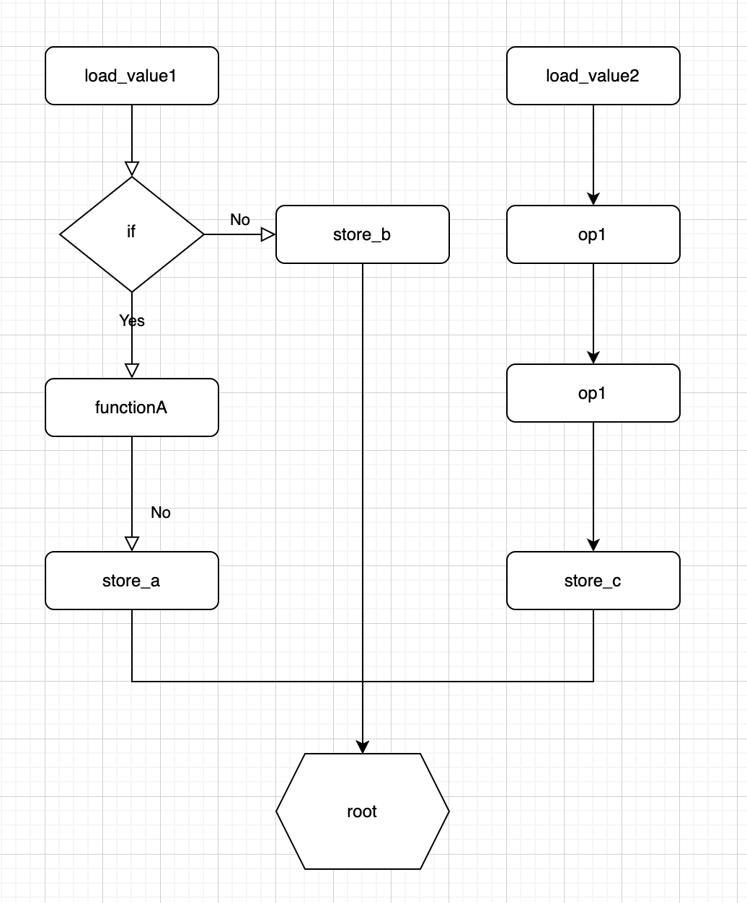

# jitfusion
A high-performance execution engine based on LLVM JIT.

# Build
Environment

  * llvm 19.1.7
  * googletest
  * xsimd-13.2.0 (optional)

First, you need to have <span style="color:red">LLVM 19.1.7</span>; other versions will not work. However, if you can only use other versions, you can modify the exec_engine.cc file to adapt it, and it shouldn't require too many changes.

You can use the following command to check your version.
```bash
llvm-config --version
```

## CMake Build
```bash
mkdir CMakeBuild
cd CMakeBuild
cmake .. && make
```

If you don't need xsimd, you can use -DHAS_XSIMD=OFF.

## Bazel Build
If you are using version <span style="color:red">Bazel 8</span> or above, you will need to use the --enable_workspace=true option.

You can get the library use the following command.
```bash
bazel build //:jitfusion
```
You can get the unit test binary use the following command.
```bash
bazel build //:jitfusion_test
```

You can get the athena use the following command.
```bash
bazel build //:athena
```

You can get the athena unit test binary use the following command.
```bash
bazel build //:athena_test
```

# How to use
I considered how many types of nodes are needed to represent a function in the execution engine, and I ultimately abstracted it into 13 types of nodes:

    EntryArgumentNode: A node used to obtain the entry argument variables of a function.

    ExecContextNode: A node used to obtain the context variables of the execution engine.

    ConstValueNode: Scalar constant node.

    ConstListValueNode: List constant node.

    UnaryOPNode: Unary operation node.

    BinaryOPNode: Binary operation node.

    FunctionNode: Function node.

    IfNode: If condition node.

    SwitchNode: Switch condition node.

    NoOPNode: No operation node.

    IfBlockNode: Block-level if node. Unlike IfNode (which is an expression returning a value), IfBlockNode is a statement-level control flow node that can modify outer-scope variables within its branches. It supports when/elif/else semantics and is used in pipeline mode.

    RefNode: Reference node. Used in pipeline mode to reference a named variable defined in a previous statement within the same NoOPNode, avoiding redundant subtree cloning and reducing IR bloat.

    OutputNode： Used for optimizing complex scenarios. Data is not returned via a return value but is instead written using a custom store function.


In jitfusion, there are the following data types: u8, u16, u32, u64, i8, i16, i32, i64, float, double, string, u8list, u16list, u32list, u64list, i8list, i16list, i32list, i64list, floatlist, doublelist, stringlist. The type u8 corresponds to uint8_t in C, and so on. The C structures corresponding to all types can be found in the include/type.h file.


For example, generally speaking, the process of an execution flow graph might look like this.


<div align=center></div>
</br>

Typically, the initial node is a data loading node. After a series of operations in the middle to obtain the desired value, the process is completed with a data storing node at the end.

The data reading and writing nodes can both be implemented using EntryArgumentNode and FunctionNode. You can refer to test/entry_argument_node_test.cc for more details. for example:

```c++
using namespace jitfusion;
int32_t LoadValue(void* data, uint32_t i) { return reinterpret_cast<int32_t*>(data)[i]; }

int main() {
  std::unique_ptr<FunctionRegistry> func_registry;
  FunctionRegistryFactory::CreateFunctionRegistry(&func_registry);
  FunctionSignature sign("load", {ValueType::kPtr, ValueType::kI32}, ValueType::kI32);
  func_registry->RegisterReadOnlyCFunc(sign,  reinterpret_cast<void*>(LoadValue));

  auto args_node = std::unique_ptr<ExecNode>(new EntryArgumentNode);
  auto index_node = std::unique_ptr<ExecNode>(new ConstantValueNode(1));
  std::vector<std::unique_ptr<ExecNode>> load_func_args;
  load_func_args.emplace_back(std::move(args_node));
  load_func_args.emplace_back(std::move(index_node));
  auto load_func_node = std::unique_ptr<ExecNode>(new FunctionNode("load", std::move(load_func_args)));

  ExecEngine exec_engine;
  auto st = exec_engine.Compile(load_func_node, func_registry);
  std::cout << st.ToString() << std::endl;
  RetType result;
  std::vector<int32_t> data_list = {100, 200, 300, 400};
  exec_engine.Execute(data_list.data(), &result);
}
```

The EntryArgumentNode will consistently return a pointer value, which is the input parameter for the execution engine's Execute function. By passing this value to a custom function, you can perform operations on this parameter.If you want to achieve maximum performance, you can implement the codegen function. You can refer to the implementations in the src/function directory for guidance.

The intermediate processes can all be converted into corresponding op nodes, function nodes, condition nodes, etc. Additionally, there are usually multiple execution flows within a single task, and these flows may use the same variables. To achieve maximum optimization, you can have all the store nodes ultimately point to a NoOP node, allowing LLVM to perform the optimization for you.

## Batch compilation

If you have many small expressions that all operate on the same inputs, you can compile them together into a single LLVM module with `BatchCompile`. All functions share the same JIT engine, so they use fewer memory pages and are slightly faster to initialize overall than compiling each expression in its own `ExecEngine`.

```c++
std::vector<std::unique_ptr<ExecNode>> nodes;
nodes.emplace_back(MakeExpr1());
nodes.emplace_back(MakeExpr2());
nodes.emplace_back(MakeExpr3());

ExecEngine exec_engine;
auto st = exec_engine.BatchCompile(nodes, func_registry);

// Execute a single one by index:
RetType r0, r1, r2;
exec_engine.ExecuteAt(0, entry_args, &r0);
exec_engine.ExecuteAt(1, entry_args, &r1);
exec_engine.ExecuteAt(2, entry_args, &r2);

// Or execute all of them in one call (results vector is resized automatically):
std::vector<RetType> results;
exec_engine.ExecuteAll(entry_args, &results);

// For batch-compiled functions whose root is a NoOPNode (void return type),
// use the overloads that take a `void*` result pointer instead.
```

Each expression may have its own return type; use `GetBatchFunctionReturnType(index)` to introspect.

# Optimize
It is more recommended to use this interface.
```c++
  // Applicable to more complex scenarios, users need to use an output node and a custom store function to write data,
  // and it will not return data from the root node. and root node must be the NoOpNode.
  Status Execute(void* entry_arguments, void* result);
```
This function does not return data through the root node; instead, the user provides a pointer for writing, which can be obtained through the OutputNode.This function require that the root node must be the NoOpNode.

It is recommended to divide custom functions into two categories: read-only functions and store functions. Read-only functions can either be data loading functions or computation functions that generate an intermediate variable. It is not recommended for computation functions to directly modify parameter variables; instead, they should return the computation result by generating a new variable. In this case, you can set a read-only attribute for your function, as shown in the code below.

```c++
uint32_t LoadU32(void* entry_arguments, int32_t index) {
  auto* args = reinterpret_cast<uint32_t*>(entry_arguments);
  return args[index];
}

FunctionSignature sign("load", {ValueType::kPtr, ValueType::kI32}, ValueType::kU32);
EXPECT_TRUE(func_registry->RegisterReadOnlyCFunc(sign, reinterpret_cast<void*>(LoadU32)).ok());
```

When use store functions, it is recommended to set the OutputNode as a corresponding attribute, similar to the code below.
The third parameter of RegisterStoreCFunc is used to tell jitfusion which argument is the OutputNode.

```c++

int32_t StoreF32(void* output, int32_t index, float value) {
  reinterpret_cast<float*>(output)[index] = value;
  return 0;
}

FunctionSignature sign("store", {ValueType::kPtr, ValueType::kI32, ValueType::kF32}, ValueType::kI32);
EXPECT_TRUE(func_registry->RegisterStoreCFunc(sign, reinterpret_cast<void*>(StoreF32), 1).ok());
```

If you find that you have significant overhead in memory allocation, you can perform pooling operations on ExecContext and pass it in using the function below during execution. This way, you can avoid repeatedly allocating memory.

```c++
  Status Execute(ExecContext& exec_ctx, void* entry_arguments, RetType* result);

  Status Execute(ExecContext& exec_ctx, void* entry_arguments, void* result);
```

Between two calls that reuse the same `ExecContext`, remember to invoke `exec_ctx.Clear()` — this resets the arena and clears any errors carried over from the previous call.

## Engine options

`ExecEngine` accepts an `ExecEngineOption` struct at construction time. All fields have sensible defaults; tweak them if the defaults don't fit your workload.

| Field | Default | Purpose |
| --- | --- | --- |
| `const_value_arena_alloc_min_chunk_size` | `4096` | Minimum chunk size (in bytes) for the engine-owned arena that backs constant values embedded in the IR. Raise it if you embed large constant lists / strings and want to avoid chunk churn during compilation. |
| `exec_ctx_arena_alloc_min_chunk_size` | `4096` | Minimum chunk size for the per-execution arena created when you call an `Execute*` overload that does **not** take an explicit `ExecContext`. Ignored for the `ExecContext&` overloads (the caller owns the arena). |
| `dump_ir` | `false` | When `true`, the fully optimized LLVM IR text is captured during `Compile` / `BatchCompile` and made available via `GetIRCode()`. Useful for debugging; avoid enabling in production because serializing a large Module to text is expensive. |
| `fp_math_mode` | `FPMathMode::kFast` | Floating-point semantics requested from the JIT backend. `kFast` enables FMA fusion and `-ffast-math`-style algebraic rewrites (1.3x - 2x faster on FP-heavy list kernels). Switch to `kStrict` if you need bit-for-bit IEEE-754 reproducibility (finance / risk / regression tests). |

Example:

```c++
ExecEngineOption opt;
opt.fp_math_mode = FPMathMode::kStrict;
opt.dump_ir      = true;
ExecEngine exec_engine(opt);
```

# Thread safety

The library is designed around a "compile once, execute from many threads" pattern.

* `Compile()` / `BatchCompile()` are **not** thread-safe. Call them from exactly one thread and finish them before any `Execute*` call.
* After a successful compile, the `Execute*` / `ExecuteAt*` / `ExecuteAll*` overloads are safe to invoke concurrently from multiple threads on the same `ExecEngine` — as long as each thread supplies its own `ExecContext`.
* A single `ExecContext` must **never** be shared across threads.
* The `Execute*` overloads that do not take an explicit `ExecContext` internally construct a fresh one on every call. They remain thread-safe but pay per-call allocation cost; prefer the `ExecContext&` overloads on hot paths.

Recommended pattern for parallel execution: one shared `ExecEngine` plus one `ExecContext` per worker thread.

# Attention
1.If you need to allocate memory that you cannot manage yourself and require the execution engine to manage it for you, you need to use the ExecContextNode. The ExecContext structure corresponding to ExecContextNode contains an arena. By using it to allocate memory, the memory will be automatically released when the execution is complete.

You can refer to test/exec_context_node_test.cc for more details. for example:

```c++
using namespace jitfusion;
U32ListStruct CreateU32List(void* ctx) {
  auto* exec_ctx = reinterpret_cast<ExecContext*>(ctx);
  U32ListStruct u32_list;
  u32_list.data = reinterpret_cast<uint32_t*>(exec_ctx->arena.Allocate(sizeof(uint32_t) * 4));
  u32_list.data[0] = 1;
  u32_list.data[1] = 2;
  u32_list.data[2] = 3;
  u32_list.data[3] = 4;
  u32_list.len = 4;
  return u32_list;
}

int main() {
  std::unique_ptr<FunctionRegistry> func_registry;
  FunctionRegistryFactory::CreateFunctionRegistry(&func_registry);
  FunctionSignature sign("create_u32_list", {ValueType::kPtr}, ValueType::kU32List);
  func_registry->RegisterReadOnlyCFunc(sign, reinterpret_cast<void*>(CreateU32List));

  auto args_node = std::unique_ptr<ExecNode>(new ExecContextNode);
  std::vector<std::unique_ptr<ExecNode>> create_func_args;
  create_func_args.emplace_back(std::move(args_node));
  auto create_func_node = std::unique_ptr<ExecNode>(new FunctionNode("create_u32_list", std::move(create_func_args)));

  ExecEngine exec_engine;
  auto st = exec_engine.Compile(create_func_node, func_registry);
  RetType result;
  exec_engine.Execute(nullptr, &result);
}
```

# Supported functions

Currently supported function documentation：[function.md](doc/function.md)

# Tools

* athena：An execution engine utilizing DSL in combination with jitfusion. You can find more details in the [athena](athena) directory.